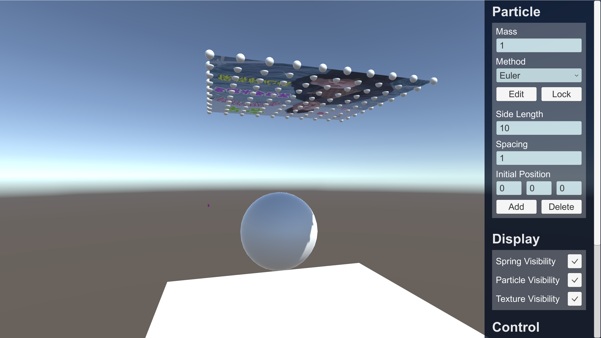
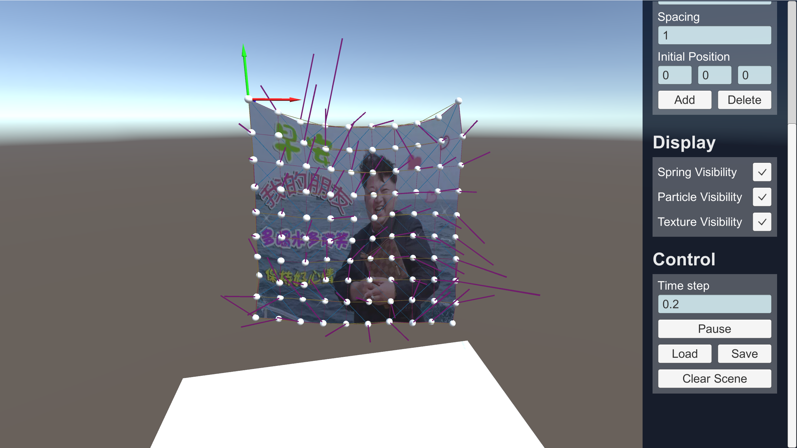
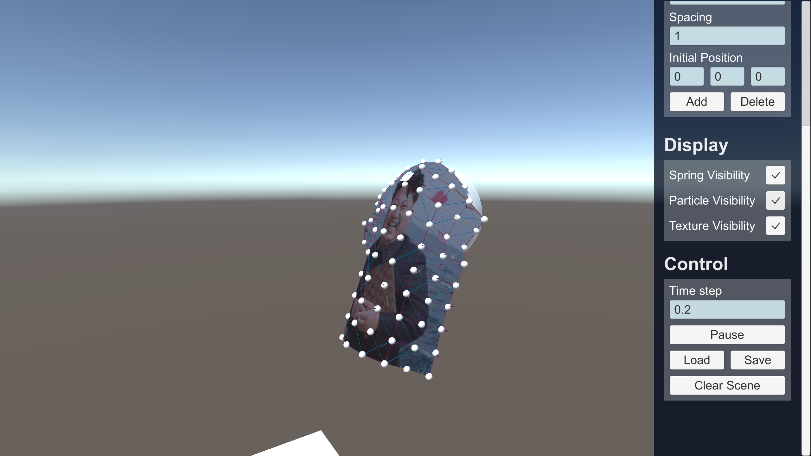
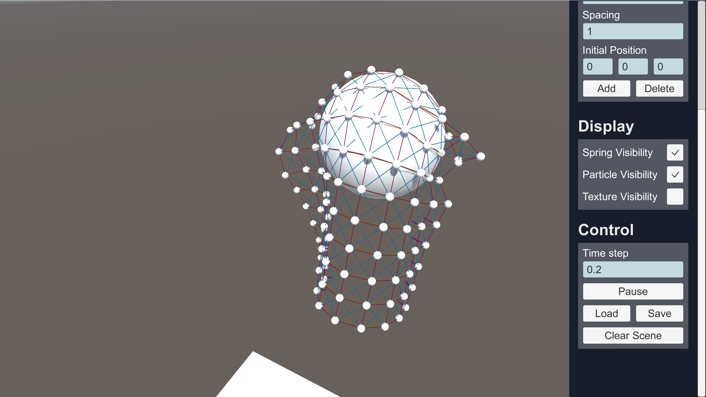

# Particle Simulation | 3D Game (I) Project 5 技術文件

## 使用
右側為 MENU，可透過滑鼠拖曳上下滾動。
### MENU-Particle
直接點選布料的 Particle 可以透過 Cursor 移動 Particle，並且可以透過 MENU 更改布料的屬性，如演算法 ( `Euler` / `Runge-Kutta 2` / `Runge-Kutta 4` )、Particle 固定與否、Particle 質量。
而新增布料前，可以設定其初始位置、粒子間距、邊長等參數，按下 Add 按鈕新增一塊新的布料。

### MENU-Display
可以選擇是否顯示 `彈簧與粒子的受力` `粒子` `布料材質`

### Control-Display
可以控制播放、Particle 參數的存讀檔、以及清除場景回到初始狀態。

## 截圖

## Video
